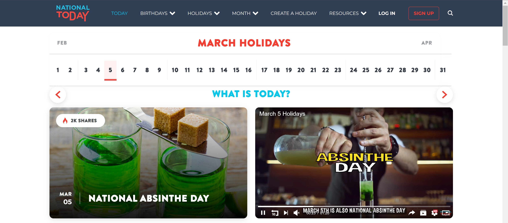

    <h1>"National Day of..." Zoom Background</h1>
    <i>A light, python based interface for celebrating the weird holidays of the world</i>

 

  
  

 
## Introduction
In the early days of my time at ShiftKey, our data team of ~8 people had a fun tradition at standups; we would all change our zoom background to whatever the "National Day of" was for the day. This team was fully remote, and it provided a way for us to all start the standup on a positive, less work-centric note.

Our bible for these holidays was [NationalToday.com](https://nationaltoday.com/today/), and they ranged from the normal (think Columbus day, Celebrity Birthdays, etc) to the abnormal (of which my personal favorite is "National Backflow Preventer Day", aka [August 16th](https://nationaltoday.com/national-backflow-prevention-day/#:~:text=National%20Backflow%20Prevention%20Day%20is%20observed%20on%20August%2016%20every%20year.)).

As our team got bigger, and priorities became more urgent, much of the team slowly began to stray from this tradition I held so dearly. I have been doing so every day for nearly 2 years as of writing(!), so I figured I would try to bring back the spirit and make the process easier.

Thus, this project was born to automate it away, as any good engineer is keen to do. I hope you enjoy this silly, but ultimately fun project!

## Purpose
As mentioned above, the high level goal is to simplify the effort involved with celebrating our tradition, without taking away all the fun.

At its core, the tasks involved to celebrate with me involve:
1. Navigate to [NationalToday.com](https://nationaltoday.com/today/)
2. Look through the holidays for today, and identify the one you relate to the most
3. Open up a new tab, and search for images of said holiday
4. Find an image you like, and download it
5. Once you join your first zoom meeting, you have to set this as your virtual backgroung

Now that may not sound like a whole lot to do, but when you have a dozen other priorities, its 9 AM, and everyone is wanting to get done with standup, it can be a tough sell to put in the extra effort.

## Architecture
*Authors Note: There is currently a massive rework underway for this project. I initially built the entire thing on a 5 hr plane ride, so it was rusty and has poor UX. The longer term state is to be written in JavaScript, and be interacted with via an Electron application. For now, bear with the rough edges :)*

This project is dead simple as it sits today, which is written in python and ran on a users own python installation. The high level flow for the script is:
1. Read a user provided config to handle the various configurable settings that the app allows.
     These are attributes set in `config.yaml`, such as a custom zoom path, control over birthday behavior, and whether it will auto-select
2. Perform an HTTPS GET call to retrieve the content at [NationalToday.com](https://nationaltoday.com/today/)
3. Use BeautifulSoup (a python libray for interacting with structured XML/HTML) to extract the holidays from the returned HTML
4. Prompt the user for selections based on their elected behavior
5. Use the `bing_image_downloader` python library to pull images for the selected holiday
6. Prompt the user for image selection
7. Find the latest image used as a virtual background in zoom (based on modified date), which will be the users current background
8. Replace this image with the selected image
   
If all goes well, when the user hops into their next "quick chat" zoom with a coworker, they will have a testament to the wonderful whacky holidays of the world as their Zoom background.

## Usage
To use, ensure you already have used a virtual background before in zoom. This is required, as this effectively commandeers the file name and locations of the last modified custom background.

If you have a default install directory for zoom, there are no configuration steps needed. If you do have a custom install, or encounter issues, set the `zoom_custom_path` var in the `config.yaml` to the `data` folder in your zoom app files.

1. Run the `daily-zoom-background.py` script
2. (Optional) Schedule using windows .bat, cron, etc
3. Provide the holiday of choice, or a comma separated list to download the top images for each holiday provided
4. Review the images downloaded, and make your final holiday and image selections
5. You're done! Your zoom background should now be a represenation of your favorite holiday

Optionally, explore the 'config.yaml' for more customization options, including the 'auto_selection' mode, birthday mode, image # controls, etc.

## Credits
[The holidays are grabbed from this site](https://nationaltoday.com/today/)

The images are downloaded via [bing-image-downloader](https://pypi.org/project/bing-image-downloader/)

## Future improvements
There are two major pathways I see for improvement:
1. Lighten the load and requirements for a client by pulling from a central source that has already grabbed the holidays and made them publicly accessible in an easier format
2. Enable a more pleasant UX via an Electron front end, and enabling deeper configuration and features
3. (bonus) Possible additional pathway for using GenAI to create images combining holidays, as was a common trend among the team.

My immediate focus is on creating a central holiday data store, and allowing users to pull from it via an API to simplify it to a call executable practically anywhere (cURL, any program, browser, etc).

After this, I will focus on making it far more user friendly and basically rewriting everything else in JavaScript (python is my home language, but not the best for such a use case).

## License
This project is under the MIT License, feel free to use however you see fit!
